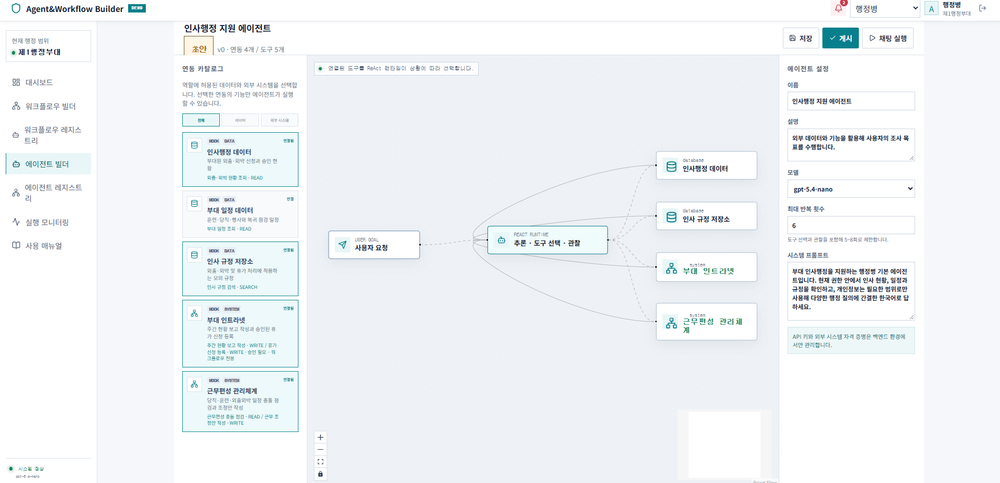
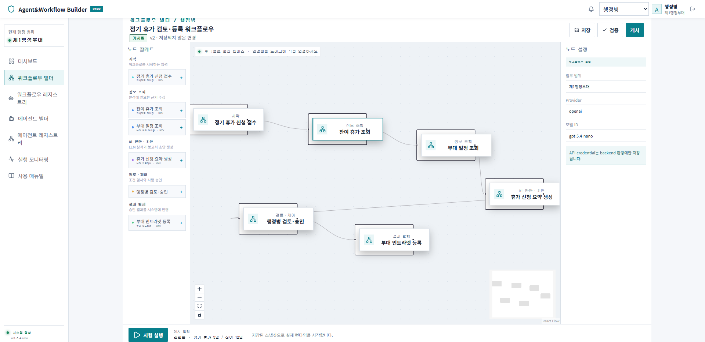

# 국방 워크플로우·에이전트 빌더 데모

역할별 워크플로우와 ReAct 에이전트를 만들고 실행하는 세미나용 데모입니다. React Flow 기반 빌더, LangGraph 승인 흐름, 역할별 에이전트 채팅과 지휘관 상황판을 한 애플리케이션에서 보여줍니다.

## 주요 화면





## 요구 환경

- Python 3.11 이상
- Node.js 20 이상

## 환경 변수

프로젝트 루트에 `.env` 파일을 만들고 모델 설정을 입력합니다.

```dotenv
OPENAI_API_KEY=발급받은_API_키
OPENAI_MODEL=gpt-4.1-mini
OPENAI_ALLOWED_MODELS=gpt-4.1-mini,gpt-5-mini
```

기본 실행 모드는 OpenAI Responses API입니다. 외부 호출 없이 화면 흐름만 확인하려면 다음 값을 추가합니다.

```dotenv
DEMO_MODEL_MODE=deterministic
```

API 키는 백엔드 환경에서만 사용하며 Git에 커밋하지 않습니다.

## 실행

첫 번째 PowerShell에서 백엔드를 실행합니다.

```powershell
cd backend
python -m venv .venv
.\.venv\Scripts\Activate.ps1
pip install -r requirements.txt
python -m uvicorn app.main:app --reload
```

두 번째 PowerShell에서 프론트엔드를 실행합니다.

```powershell
cd frontend
npm install
npm run dev
```

브라우저에서 `http://localhost:5173`을 엽니다.

## 역할

- 파주지역 분석관: 센서 이벤트 분석과 지역 보고서 승인
- 정보·작전 참모: 승인 지역보고 종합과 지휘관 보고서 승인
- 지휘관: COP 지도, 내장 기본 에이전트, 종합 판단과 최종 보고 열람
- 행정병: 휴가 신청 검토와 모의 인트라넷 등록

## 문서

- [제품 요구사항](docs/PRD.md)
- [시스템 아키텍처](docs/ARCHITECTURE.md)
- [사용자 화면 명세](docs/UI_SPEC.md)
- [데모 시나리오와 검증 기준](docs/DEMO_SCENARIO.md)
- [현재 구현 상태](docs/IMPLEMENTATION_STATUS.md)

현재 구현과 알려진 제한사항은 [현재 구현 상태](docs/IMPLEMENTATION_STATUS.md)를 먼저 확인하세요.
